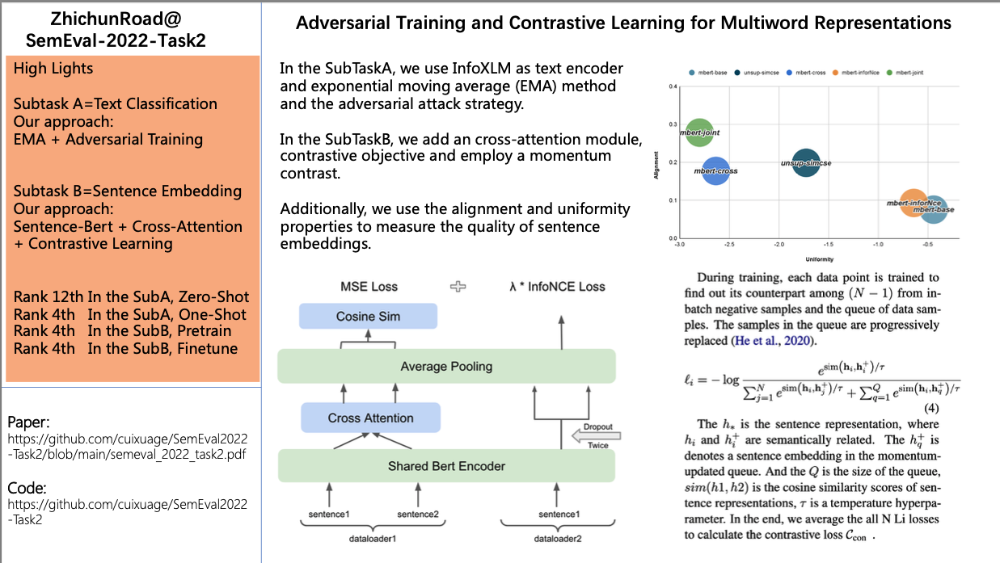
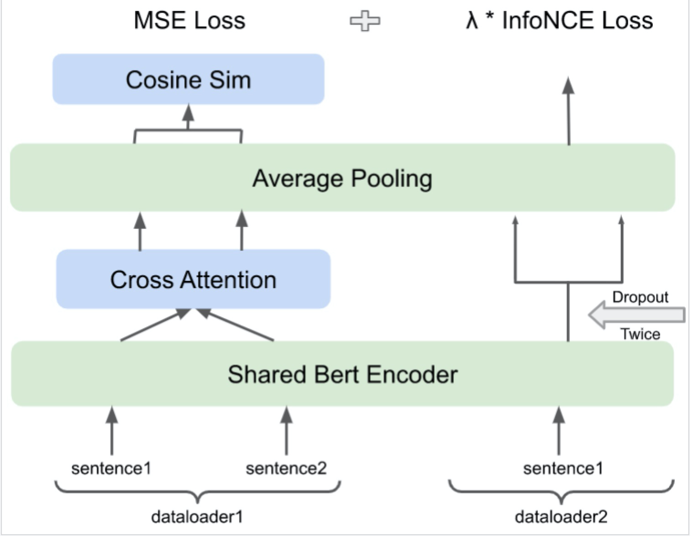
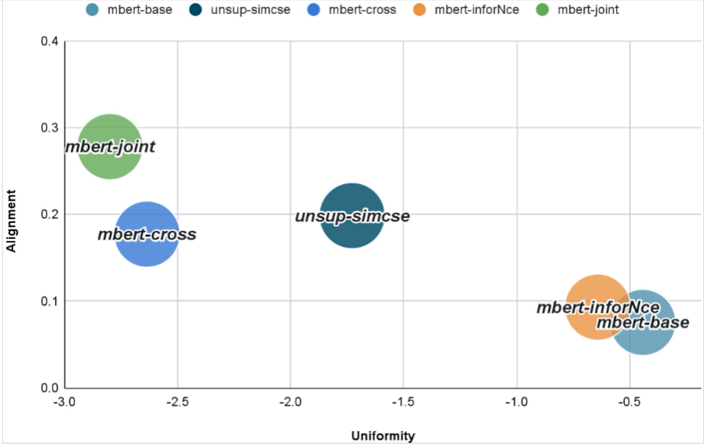

# ZhichunRoad@SemEval2022-Task2   

Paper: [Adversarial Training and Contrastive Learning for Multiword Representations](https://aclanthology.org/2022.semeval-1.24/)    
  
**1.Abstract:**      
In the SubTaskA, we use InfoXLM as text encoder and exponential moving average (EMA) method and the adversarial attack strategy.    
In the SubTaskB, we add an cross-attention module, contrastive objective and employ a momentum contrast.    
Additionally, we use the alignment and uniformity properties to measure the quality of sentence embeddings.    
  

  

**2.Code & Ranking**     
ZhichunRoad At SemEval2022-Task2    
```
+-------------------+---------------------------------------+---------------------+---------+
|      SubTask      | file                                  | Module              | Ranking |
+-------------------+---------------------------------------+---------------------+---------+
|     zero-shot     | no_trainer_zero_shot.py               | EMA + Smart         | 12      |
+-------------------+---------------------------------------+---------------------+---------+
|     one-shot      | no_trainer_one_shot.py                | EMA + FreeLB        | 4       |
+-------------------+---------------------------------------+---------------------+---------+
| pretrain/finetune | CosineSimilarityCrossAttentionLoss.py | MSE Loss            |         |
+-------------------+---------------------------------------+---------------------+---------+
| pretrain/finetune | NegativesRankingLoss_MoCo.py          | InfoNCE Loss + MoCo |         |
+-------------------+---------------------------------------+---------------------+---------+
| pretrain/finetune | CrossAttention.py                     | NetWork             |         | 
+-------------------+---------------------------------------+---------------------+---------+
| pretrain/finetune | MoCoBuilder.py                        | NetWork             |         |
+-------------------+---------------------------------------+---------------------+---------+
|     pretrain      | EmbeddingCrossSimEvaluator.py         | Eval                | 4       |
+-------------------+---------------------------------------+---------------------+---------+
|     finetune      | EmbeddingCrossSimEvaluator.py         | Eval                | 4       |
+-------------------+---------------------------------------+---------------------+---------+
```

**3.Discussion**  
<!--   
  -->
  
i.  Dev-F1 score, InfoXLM > XLM-R > M-bert.       
ii. Using the EMA-Method and Adversarial-Training can improve the model robustness.    
iii.Contrastive learning can further improve the performance of sentence representations.   
iv. The trade off between the alignment and uniformity indicates that perfect alignment and perfect uniformity are likely hard to simultaneously achieve in practice.  
  
**4.Conclusion**  
In the SubTaskA,   
i.  We use InfoXLM-Base as text encoder.(Performance: InfoXLM > XLM-R > Mbert)   
ii. We use exponential moving average Method.  
iii.We use adversarial attach strategy.(Performance: Smart >= FreeLB > PGD = FGM)  
   
In the SubTaskB,  
i. We add CrossAttention Module at the top of Sentence-Bert.  
ii.We add an extra Contrastive Loss.(Inspired by Simcse + MoCo)   
