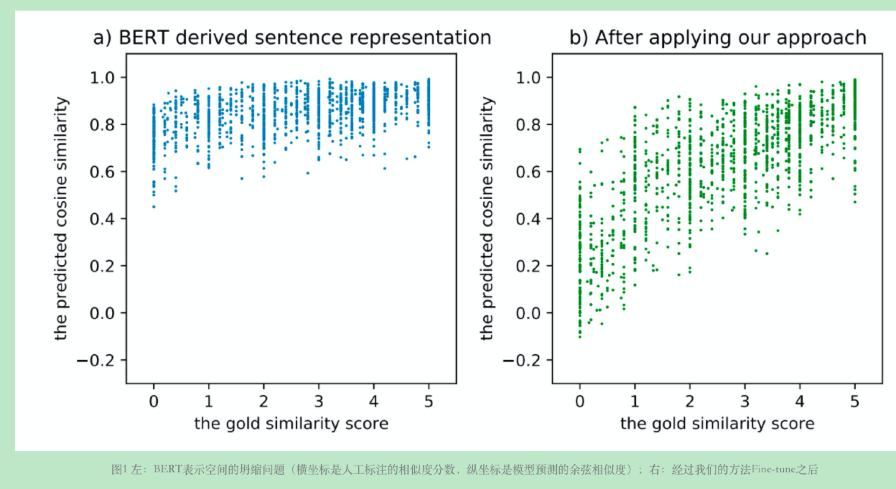
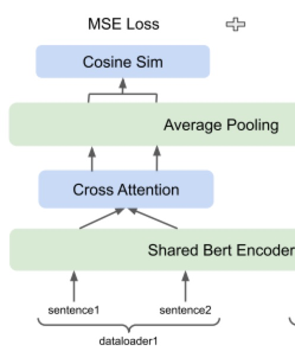
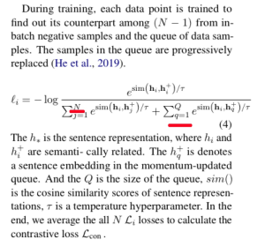

```
背景:    
    对于Bert Encoder编码后的Token-level emb，计算其mean_pooling作为句子向量的表达，往往存在"坍缩"现象。[1]    
解释:     
    本质是高频词语向量"主导"句子向量，可能导致语义无关的语句其句子向量也具有较高的相似度分数（Consine Score）。[1]    

横轴: 人工标注标签0-5  纵轴:句子相似度。蓝色: bert-base  绿色:ConSert[1]    
    
适用场景: 双塔的文本语义匹配    
    
    
总结解决"语义表示坍缩"思路:    
a. 修改Model Encoder    
    双塔模型的适用边界: 经典Sentence-Bert，为了计算效率，没有引入复杂的交互计算。token-level — mean pooling  — consine score    
    i. 后期交互使用CrossAttention Module    
        token-level embedding   — 通过CrossAttention互相重新表征 — mean pooling — consine score    
        代码:   链接（使用self-attention代码，需将KV mask传递另一侧句子的padding mask）        
         
    Q: 效果怎么样？    
        A1: 评估阶段和训练阶段网络结构相同，验证CrossAttention结构有效性。Spearman -0.02%(dev)    
        A2: 评估阶段仅使用Hidden-Status，不使用CrossAttention，验证Encoder本身的语义区分程度。Spearman +0.6%(dev)    
        A3: 使用额外的网络反过来提升Encoder产出的Hidden status。类似情形有:  1. SimCLR，RELU+MLP非线性变化  2.淘宝-2022 QP分享-Query和VariantQuery的实现思路    
        思路抽象:  训练阶段增加额外的NN网络(projector)对于Hidden-Status做非线性变化，仅增加训练时间，并不会增加Predict时间。此方式简单直接，也许是个可以尝试的策略。    
    Q: 为什么使用CrossAttention而不是MLP？      
        A: 没有验证MLP的效果，不过使用2.5w条数据已经可以"驱动"Bert-Base + CrossAttention模型结构。    
    Q:还有哪些Encoder的级别的改动，能更准确是实现表征句子向量呢？  
        A:持续追踪中....   
   
b. 添加额外的Los损失函数  
    有监督学习MSE Loss的适用的边界: 指导模型优化"绝对"距离。举例Sentence-Bert，句子向量的Consine相似度尽可能逼近真实值Label。  
    对比学习的Loss:  希望指导模型优化"相对"距离。锚点和正例(1个)之间足够近，锚点和负例们（2N-2个）之间足够远。[2]  
    从对比学习Loss函数的定义能够看出，可优化的有三个方向:[3]  
        i. 正例负例的构造（图像: 颜色、翻转    NLP: Token-level裁剪，Dropout）  
            绿色: batch_size原始样本，紫色:对应产生的"正例"样本。对角线: label=1。 损失函数: CrossEntropy Softmax Loss。  
        ii. Encoder的模型结构。(图像，文本，文本、图像)  
        iii. 扩充负样本的数目，提高hard-negative出现的概率。（MoCo: Queue）  
            核心思路抽象: 历史编码过的Embedding存放到固定大小的Queue。在当前batch计算时，Queue中的数据用于充当negative-samples。  
      
    Q: 效果怎么样？  
        A: 添加simcse的Dropout方式作为对比学习Loss，Spearman+0.2%；  
        A: 接着使用Queue扩充负例样本，Spearman+0.3%；  
    Q: Queue Size 设置大小？  
        A: 关键超参数，遵从ESimcse论文，使用2.5*batchsize大小。  
    Q: Queue越大，Hard-negative出现概率变大，但是False Negative样本出现概率也会变大。如何平衡？  
        A: SwAV   batch内部做聚类，避免简单正例样本被当做负例，变成Loss的分母。(可行思路)  
```
  
[1] ConSert，ACL 2021. 美团金融:https://tech.meituan.com/2021/06/03/acl-2021-consert-bert.html  
[2] Metric-Learning  https://gombru.github.io/2019/04/03/ranking_loss/  
[3] 微博AI-Lab负责人张俊林解释对比学习: https://www.modb.pro/db/148185  